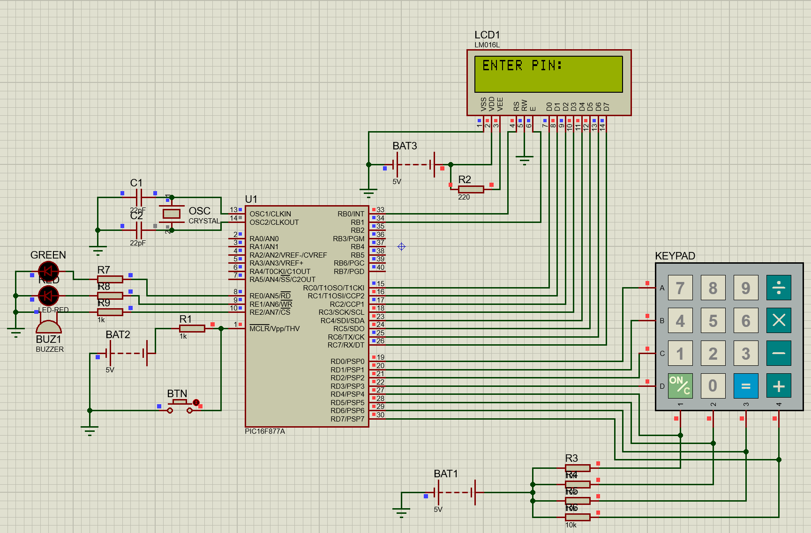
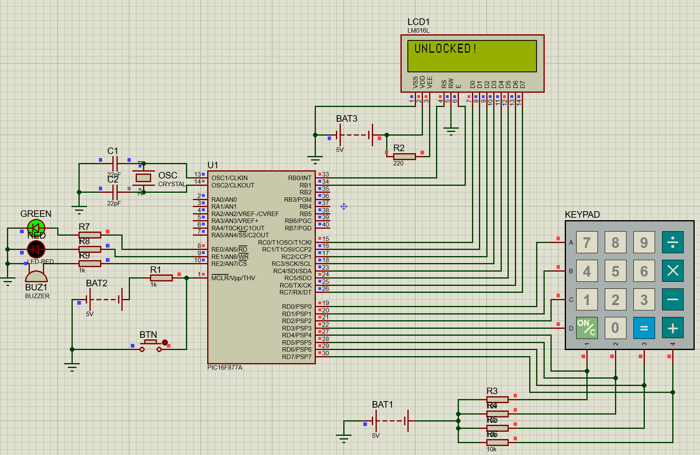
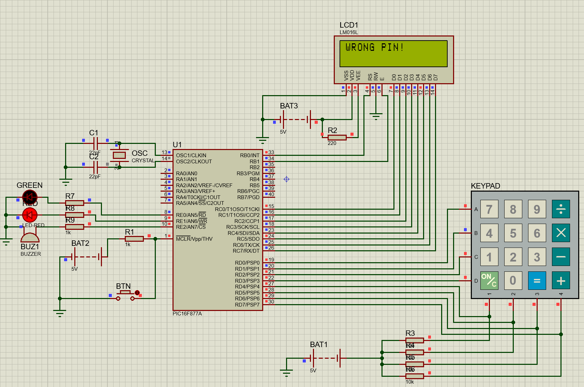
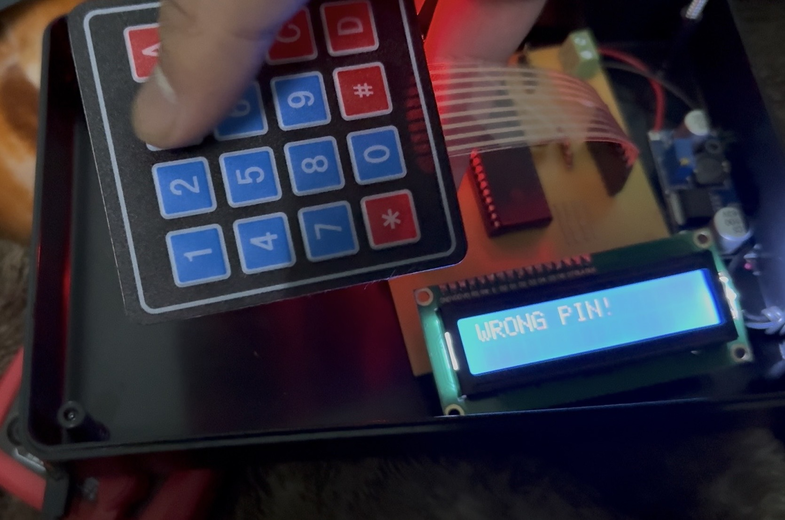

# Microprocessor-Based Electronic Safe System

An embedded system project implementing a secure PIN-based electronic safe using the PIC16F877A microcontroller. The system features persistent storage via internal EEPROM, user feedback through a 16x2 LCD display, and input handling via a 4x4 matrix keypad.

## Overview

This project demonstrates practical application of embedded systems concepts including:
- Memory-mapped I/O
- Non-volatile data storage
- Peripheral interfacing (LCD, keypad, LEDs)
- Real-time input processing
- Assembly language programming

The system provides secure access control through a four-digit PIN mechanism with visual feedback and status indication.

## Features

- **PIN-based Access Control**: Four-digit PIN entry with secure verification
- **Persistent Storage**: PIN stored in internal EEPROM (retains after power cycle)
- **LCD Display**: 16x2 character LCD for user interaction and status messages
- **Matrix Keypad**: 4x4 keypad for PIN entry
- **Status Indicators**: LED feedback for locked/unlocked/error states
- **Factory Reset**: Hold # key during power-on to reset PIN
- **Auto-lock**: 10-second timeout after successful unlock

## Hardware Components

- **Microcontroller**: PIC16F877A
- **Display**: 16x2 LCD (HD44780-compatible, RoHS 1602A)
- **Input**: 4x4 Matrix Keypad
- **Output**: Status LEDs (Locked/Unlocked/Error)
- **Clock**: Crystal oscillator circuit
- **Power**: Regulated 5V DC supply

## Pin Allocation

| Port | Pins | Function |
|------|------|----------|
| PORTB | RB0, RB1 | LCD Control (RS, E) |
| PORTC | RC0-RC7 | LCD Data Bus (D0-D7) |
| PORTD | RD0-RD3 | Keypad Rows (Output) |
| PORTD | RD4-RD7 | Keypad Columns (Input) |
| PORTE | RE0-RE2 | Status LEDs |
| OSC1/OSC2 | - | Crystal Oscillator |

## PIC16F877A Specifications

| Parameter | Value |
|-----------|-------|
| Program Memory (Flash) | 8K words (14-bit) |
| Data Memory (RAM) | 368 bytes |
| Data EEPROM | 256 bytes |
| I/O Ports | 33 pins across 5 ports (A, B, C, D, E) |
| Operating Frequency | Up to 20 MHz |
| Timers | 3 (Timer0, Timer1, Timer2) |
| Operating Voltage | 4.0V to 5.5V |

## Software Implementation

### Program Structure

The firmware is developed entirely in PIC assembly language with the following modular sections:

- **Initialization**: Port configuration, timer setup, LCD initialization
- **Main Loop**: Continuous keypad scanning and input processing
- **LCD Routines**: Command and character transmission functions
- **EEPROM Routines**: Non-volatile read and write operations
- **Delay Routines**: Timer-based timing functions

### Register Allocation

```asm
N0      EQU 0x21    ; PIN digit 0 storage
N1      EQU 0x22    ; PIN digit 1 storage
N2      EQU 0x23    ; PIN digit 2 storage
N3      EQU 0x24    ; PIN digit 3 storage
ROW     EQU 0x30    ; Current keypad row
COL     EQU 0x31    ; Detected column
INDEX   EQU 0x32    ; PIN entry index
MODE    EQU 0x29    ; Operation mode flag
TEMP    EQU 0x35    ; Temporary storage
UNLOCKED EQU 0x34   ; System unlock state
```

### System State Machine

The firmware implements the following states:

1. **Initialization State**: Hardware setup and EEPROM flag check
2. **PIN Set State**: First-time PIN configuration (MODE = 1)
3. **PIN Verify State**: Normal operation PIN entry (MODE = 0)
4. **Unlocked State**: Successful authentication with timeout
5. **Error State**: Incorrect PIN indication

## Circuit Schematic



*Complete circuit schematic in Proteus Design Suite showing PIN entry state*

## Simulation Results

### Successful PIN Verification



*Simulation showing successful PIN verification with "UNLOCKED!" display and green LED activation*

### Incorrect PIN Entry



*Simulation demonstrating incorrect PIN entry with "WRONG PIN!" message and red LED indication*

## Hardware Prototype



*Hardware prototype showing "WRONG PIN!" response on LCD display*

## Testing Results

| Test Case | Expected Result | Status |
|-----------|----------------|--------|
| Initial PIN setup | Display "SET PIN:" prompt | ✅ Pass |
| PIN storage in EEPROM | PIN retained after power cycle | ✅ Pass |
| Correct PIN entry | Display "UNLOCKED!" + green LED | ✅ Pass |
| Incorrect PIN entry | Display "WRONG PIN!" + red LED | ✅ Pass |
| PIN reset via # key | Clear EEPROM, return to setup | ✅ Pass |
| Keypad debouncing | Single character per press | ✅ Pass |
| LCD character display | Masked PIN entry with asterisks | ✅ Pass |
| 10-second unlock timeout | Auto-lock after timeout | ✅ Pass |

### Timing Measurements

- LCD command execution delay: 2ms
- Keypad debounce delay: 150ms
- Keypad scan rate: 50ms per row
- Unlock display duration: 10 seconds

## Technical Details

### LCD Interface

The LCD operates in 8-bit parallel mode with the following initialization sequence:

1. Wait minimum 40ms after power-on
2. Send Function Set command (0x38) for 8-bit, 2-line, 5x8 font
3. Send Display Control command (0x0C) for display on, cursor off
4. Send Entry Mode command (0x06) for increment cursor, no shift
5. Send Clear Display command (0x01)

### Keypad Scanning

The keypad uses row-column matrix scanning:
- Rows are driven low sequentially
- Columns are monitored for low state (indicating pressed key)
- Software debouncing (150ms) prevents contact bounce issues

### EEPROM Storage

PIN storage uses internal EEPROM with the manufacturer-specified unlock sequence:
- Write 0x55 to EECON2
- Write 0xAA to EECON2
- Set WR bit in EECON1 to initiate write
- Proper bank switching prevents data corruption

## Challenges & Solutions

### LCD Enable Timing
**Issue**: Initial implementations failed to properly complete the Enable pulse cycle.  
**Solution**: Explicit low transition after the high pulse ensures reliable data latching.

### EEPROM Bank Switching
**Issue**: Data corruption occurred when EEDATA was set before entering the write routine.  
**Solution**: Pass data through a Bank 0 register before bank switching.

### Keypad Reliability
**Issue**: Contact bounce caused multiple character registration.  
**Solution**: Increased debounce delay timing to 150ms.

## Future Enhancements

- Multiple user PIN support with user identification
- Incorrect attempt counter with lockout mechanism
- Audible feedback through piezoelectric buzzer
- Serial communication interface for remote monitoring
- Real-time clock integration for access logging with timestamps

## Development Tools

- **Simulation**: Proteus Design Suite
- **Programming**: PIC assembly language
- **Hardware**: PIC16F877A development board

## License

This project was developed as part of a Microprocessors Course Project.

## References

1. [PIC16F87XA Data Sheet](https://www.microchip.com/) - Microchip Technology Inc., DS39582B, 2003
2. [HD44780U LCD Controller Datasheet](https://www.sparkfun.com/datasheets/LCD/HD44780.pdf) - Hitachi Ltd., ADE-207-272(Z), 1999
